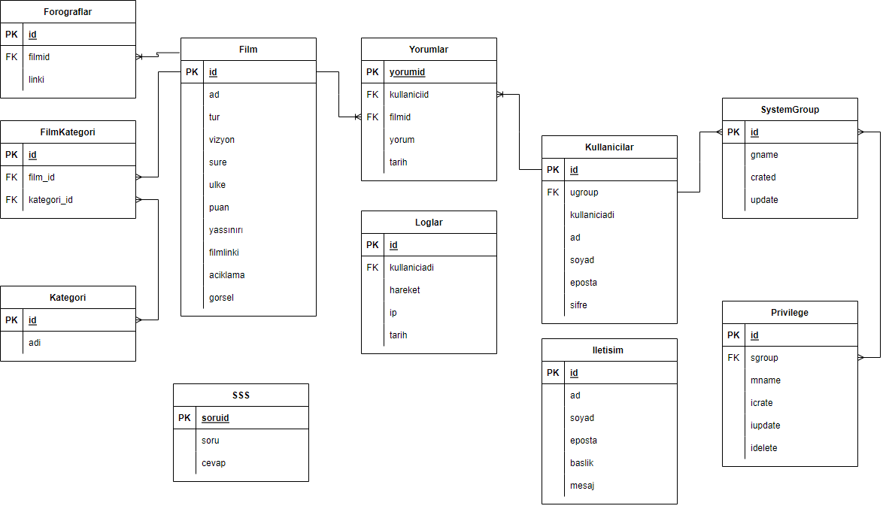

# FİLM SİTESİ

    Kullanıcılar film izleyebilir, filme yorum yapabilir ve filme puan verebilir.

# PROJE AŞAMALARI (AŞAĞIDAKİ TARİHLER SADECE ÖRNEKTİR. KENDİ TAKVİMİZİ KENDİNİZ OLUŞTURACAKSINIZ.)
- 06.03.2022 - 1.Ara Gösterim

        1. ara gösterimde neler yapacağınızı yazacaksınız

- Vize Gösterimi

        Vize gösteriminde neler yapacağınızı yazacaksınız

- 13.04.2022 - 2.Ara Gösterim

        2. ara gösterimde neler yapacağınızı yazacaksınız

- Final Gösterimi

        Final gösteriminde neler yapacağınızı yazacaksınız

# İlişkisel Veritabanı Tasarımı

# Netbeans github entegrasyonunda "Incorrect credentials" hatasının çözümü:

- Github hesabında sağ tarafta profile -> settings tıklayınız
- Sol taraftaki menüden "Developer settings" tıklayınız
- Menüden "Personel Access Tokens" tıklayınız
- Token geçerlilik süresini girdikten sonra "scope" başlığı altında "repo" işaretleyiniz
- "Generate Token" düğmesine tıklayınız
- Üretilen token bilgisini kopyalayıp netbeans deki parola kısmına yapıştırınız

